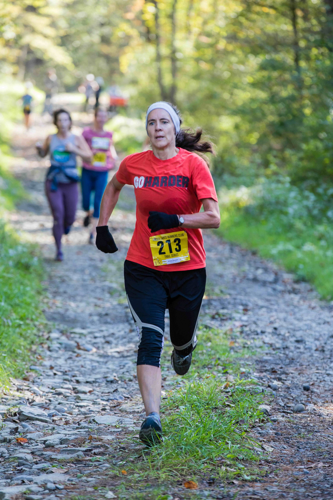
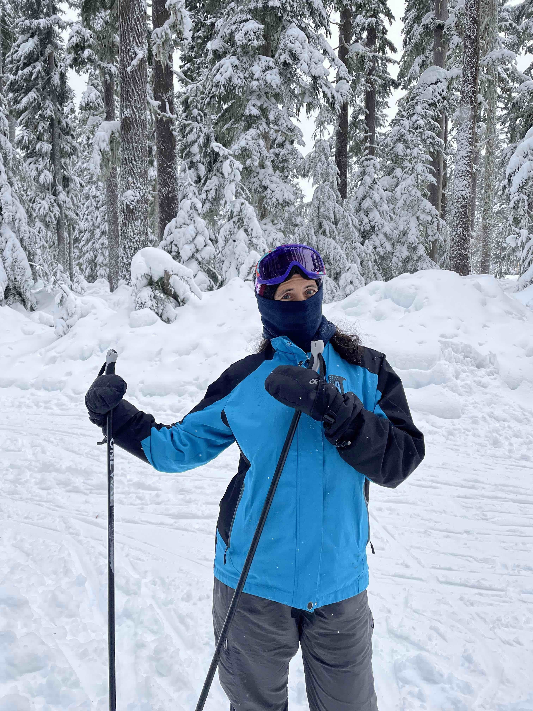

When I arrived in Ithaca I met this spectacular woman: Kristen.

I remember that one of the first things I knew about her was that she was homeschooling her two boys. And that left me speechless… in a good way.

Little by little I learned about the wonderful path that Kristen has been forging in this life, not only to be happy herself but to help other people, especially those who need it most.

Kristen has a heart the size of the entire planet!

Here are the answers Kristen sent me to my 10 questions:

***1. How would you describe yourself?***

I am someone who has a hard time with “Nos.” I have perhaps an unusual level of self-confidence. I get an idea or decide I want to learn how to do something, I am usually confident that I can achieve a basic mastery. I have a lot of energy and am curious. I also love to work with my hands and to be outside. I’ve always gravitated to things that are outside the social norm or an unusual challenge – working construction as a woman, learning new languages, and homeschooling our children, to name a few. I am someone who can’t sit still and feels like there are never enough hours in the day to accomplish everything I would have liked to have done that day!

***2. What do you want from life?***

I want to be happy and for everyone around me to be happy. I try to spend at least some of my free time every week doing something to make the world a better place. I want people to remember me as someone who made a small difference in their lives.
I think the last three paragraphs of this poem by Mary Oliver sum it up best.

>When it’s over, I want to say: all my life\
>I was a bride married to amazement.\
>I was the bridegroom, taking the world into my arms.

>When it is over, I don’t want to wonder\
>if I have made of my life something particular, and real.\
>I don’t want to find myself sighing and frightened,\
>or full of argument.

>I don’t want to end up simply having visited this world.
  
***3. Why do you do the things you do?***

I have tried to find a balance in life between doing things for others and finding time for myself. I feel so lucky to have been able to homeschool our two boys and to have had jobs that are intellectually challenging. I am very motivated by other people’s positive energy, but not very good at dealing with people when they are sad or frustrated. I try to be a positive force in the world and hope that a smile and an act of kindness can make a difference.
  
***4. How do you understand the process of "what if I say yes?"***

What speaks to me from Héctor’s letter is the importance of taking emotional risks. Stepping outside of your comfort zone and trusting that it will all turn out okay. Having faith in the basic goodness of your fellow human beings and learning how to appreciate the unique gifts that we all bring to the world. Saying “Yes” is learning how to create adventures for yourself that force you to be open to new ideas and ways of viewing the world. Those adventures can be as simple as taking a different walk every day and saying hello to someone new or as bold as changing careers or taking a trip to a place where you don’t speak the language.
  
***5. What would you say was your first "what if I say yes" moment?***

Saying “Yes” is about believing in yourself, in something magical. Children are natural believers in their power to change the world, and I credit my parent’s unending support for making that magic last a long time. I do remember being incredibly frustrated as a child that they couldn’t help me really publish the book I had written. Or that the picnic table I had invented with my Legos that converted from a patio table to a picnic table for two couldn’t be immediately sold to a manufacturer and mass-marketed to everyone I knew. “Why weren’t these grown-ups seeing the “Yes” possibilities in my ideas?” I used to think.

***6. Describe your most recent "what if I say yes?" moment.***

My most recent “What If I Say Yes” moments have been about listening. What if I just slow down and spend time with friends listening, really listening to them? For someone who is constantly on the go, saying “Yes” has meant learning better how to just be in the moment and be present with other people.

I am also very conflict-averse. I have a big “No” alert that pops up in my brain when there is the potential for conflict. So, confronting hard emotions with my family have been “Yes” moments as well.

***7. What things have you created in your life after saying "what if I say yes?" Make a list.***

- A beautiful family!
- Housing for families working for Habitat for Humanity
- New friendships around the world
- A backyard shed I am proud of
- Drawings and a very angry self-portrait

***8. How have others reacted to your “what if I say yes?” process?***

Most people react positively.
  
***9. What will be your next “what if I say yes” moment?***

If I could predict it, I don’t feel like it would be a true “What if I Say Yes” moment. But on a more meditated level, I think that the decision that Isaiah and I made to start Arabic lessons together is our next “What If I Say Yes” adventure. We’ve already met new people and learned many new cultural facts in addition to the language itself.  I love the fact that learning another language literally gives you the possibility of meeting and connecting with millions of more people in our great big world!
  
***10. What have you learned from the "what if I say yes" process?***

What I have learned from the “What If I Say Yes” process is that not everyone is as open to some ideas as I am. And I have to be careful not to hurt people I love with too many “Yeses.” If you use Héctor’s analogy of a “Yes” being the expansion of your little personal fence to include a new space, we don’t live in a space-infinite world. Sometimes my expansion of a fence can infringe upon someone else’s safe space. That is what I need to be most careful of.

