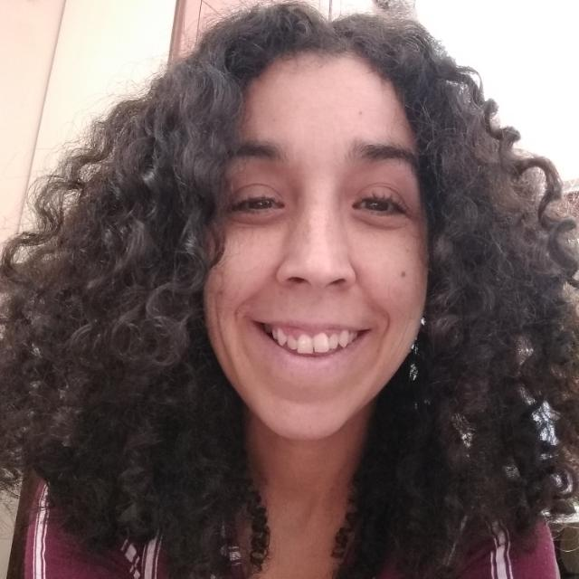

***1. ¿Cómo te describirías a ti misma?***

Lo que más me gusta de mí es que soy creativa. Tomo una idea y la uno a otra y hago preguntas con el resultado, o la exagero a ver qué pasa, o la dibujo, en fin. Trato de pensar siempre cosas nuevas. También me gusta el equilibrio. Hace tiempo decidí que siempre tengo que leer las dos partes de un debate. Una supervisora siempre me escuchaba contar la historia de algún paciente y me decía, ok, ¿pero y si la historia fuera al revés? Me encanta esa pregunta porque abre la mente a otros caminos; creo que dudar es necesario siempre.

Soy preocupona, siempre estoy pensando en hacia dónde van los acontecimientos y trato de resolverlos sin estar ahí aún. A veces me hace falta frenar y tomarme no tan en serio. Por eso el sentido del humor es importante, detenerme a reír es de las cosas más liberadoras y nutricias que puedo hacer por mí.

Creo que soy buena con las palabras, a veces no recuerdo dónde las leí, pero puedo obsequiarlas sin problema y tengo alguna para cada ocasión.

***2. ¿Qué quieres de la vida?***

Café y chocolates ilimitados. También me gusta el orden, aunque no de objetos, sino de ideas, de afectos. Me encantaría que al final de los tiempos todo se acomodara, que todas esas grandes preguntas de la humanidad encontraran su casilla como un gran sudoku. Y al final algún niño pusiera el 9 en su lugar y en todo el universo sonara ¡Click! Todo acomodado ya.
  
***3. ¿Por qué haces las cosas que haces?***

No tengo razones para sospechar que todo irá mal o que todo irá bien. No tengo ese tipo de brújula. Pero sé que me hace una diferencia elegir pensar que vale la pena el día a día y el granito de arena de cada uno. Después de preocuparme, elijo creer que las cosas saldrán y que vale la pena seguir construyendo juntos la humanidad. Entonces a pesar de mis preocupaciones, actúo.

Creo en las personas y sé que los que vienen, nuestros hijos, merecen adultos que los ayuden a tener esperanza. El cinismo y el sinsentido son fáciles. Tener esperanza se vuelve un acto valiente y obligado con las siguientes generaciones.
  
***4. ¿Cómo entiendes el proceso de "¿y si digo que sí?”***

Me hago muchas preguntas todo el tiempo. Cuando organizo mis preguntas en alguna historia razonable que me guste, trato de volverla realidad. Es como escribir el libro de mi vida antes de vivirla, pero está tan bueno que quiero hacerlo real.
  
***5. ¿Cuál dirías que fue tu primer momento de "¿y si digo que sí?"***

Tenía como 9 años y un día me puse a llorar. Mucho. Los que dicen que los niños nunca están tristes simplemente no se acuerdan. Recuerdo que no me gustaba a dónde iba mi vida e hice una lista de cosas que quería cambiar. ¡Y las hice!

***6. Describe tu momento más reciente de "¿y si digo que sí?".***

Un amigo terapeuta me invitó a su live en Facebook sobre la película de Encanto desde la perspectiva de la terapia familiar. Nunca lo había hecho, pero me alegró que me invitara, es un tipo muy cool. Creo que la alegría es una buena brújula para actuar, así que sin pensarlo mucho sino saboreando mi sonrisa le dije que sí.

***7. ¿Qué cosas has creado en tu vida después de haber dicho "¿y si digo que sí?” Haz una lista.***

Publicaron una colaboración mía para un periódico universitario.
Fui voluntaria en una línea de apoyo terapéutico por teléfono.
Lidereé un retiro espiritual de fin de semana.
Busqué un servicio social que realmente me fascinaba con viejitos.
Trabajo diario en el camino a una vejez feliz junto a mi amor, mi esposo.
Inicié un cómic con las peripecias de mi familia, que me encanta porque me fuerza a pensar las cosas de forma más suave y simpática.
Hice un reto de bailar en público en 10 eventos diferentes.
Acepté un trabajo que me daba terror y del que me siento súper orgullosa donde daba terapia a chavos en problemas con la ley.
Formé mi familia por adopción con 2 niños hermosos.
Salí en 2 entrevistas en tele hablando de adopción en México.

***8. ¿Cómo han reaccionado los demás a tu proceso de "¿y si digo que sí?”***

Con cercanía. Creo que mientras más me busco, más encuentro mi humanidad compartida.
  
***9. ¿Cuál será tu próximo momento de “¿y si digo que sí?”***

Aún no lo sé.
  
***10. ¿Qué has aprendido del proceso "¿y si digo que sí"?***

Me ayuda un montón vivir la vida en equipo. Tener gente que me respalda, que me escucha, me quiere y me acompaña a reír. Yo espero ser el equipo de ellos. No vale la pena el viaje si no es en equipo con quien amas. Y cuando me aventuro, gano historias. Al final creo que eso somos, un montón de historias que narramos a los que vienen y van corriendo por generaciones como el murmullo de un riachuelo que se une a otro que se une a otro y forma una gran cascada al final.

