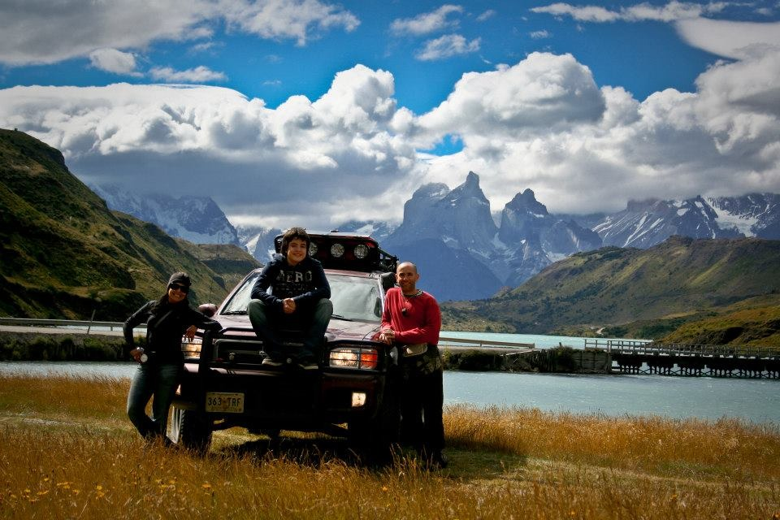
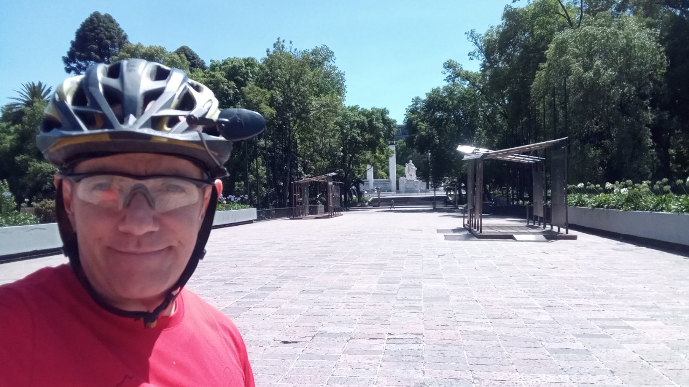

Luis es el ejemplo perfecto de alguien que está dispuesto a enfrentar sus miedos y probar cosas nuevas, audaces y emocionantes.

Como mi hermano mayor, era el que abría el camino, y siempre nos asombraban principalmente dos cosas: su capacidad de aventura y su disciplina para estudiar un tema específico.

Aquí hay 10 preguntas que le hice para que lo conozcan mejor:

***1. ¿Cómo te describirías a ti misma?***

Siempre me gustó aprender. Desde que recuerdo siempre me interesaba entender cómo funcionaban o se hacían las cosas. Eso me ha llevado a vivir distintas etapas en mis 55 años, a través de las cuales creo que he ido cambiando paulatinamente hasta considerarme una persona totalmente diferente entre etapas y a lo largo de mi vida.

Actualmente mi enfoque se ha volcado en la paz interior, sin dependencia de lo externo, y por ejemplo, mi enorme disciplina (con la cual pude concretar casi todos los proyectos en los que me he embarcado, y que sufrí por cinco décadas y media), se está convirtiendo poco a poco en gozo y en la apertura de un potencial mental y físico que nunca imaginé yacía en mi interior.

***2. ¿Qué quieres de la vida?***

Paz interior.

***3. ¿Por qué haces las cosas que haces?***

Apenas estoy aprendiendo que todo lo que hacemos es compulsivo. De alguna manera la humanidad ha perdido el sentido real de la vida, que es la vida misma, y lo ha confundido con los accesorios de la vida (trabajo, familia, recreación, etc.)

La única manera correcta de iniciar una acción, cualquiera que ésta sea, es desde la paz interna.

La acción se convierte en consciente inmediatamente, y en vez de buscar el gozo a través de los estímulos externos, el gozo de la acción se añade a la paz que ya estaba ahí antes.

Paz interior no puede ser la meta; al contrario, es absolutamente indispensable para poder pensar en gozo real.
  
***4. ¿Cómo entiendes el proceso de "¿y si digo que sí?”***

“No” es una protección. Hacemos casas para protegernos, pero si no ponemos puertas entonces la protección se convierte en tu celda.

“Sí” son las puertas abiertas. Nos protegemos, pero siempre esperamos salir a la vida a vivirla.
  
***5. ¿Cuál dirías que fue tu primer momento de "¿y si digo que sí?"***

Muy difícil saber cuál haya sido el primero... pero recuerdo que en el sitio web que hizo mi hermano Jorge, para nuestro viaje de 2005 a Alaska en la camioneta, unos amigos que hacían carreras de aventura sugirieron el viaje a la Patagonia.

Recuerdo claramente haber pensado: “eso jamás va a suceder”.

En el 2007 debo haber pensado: “y si digo que si?”

Corte a 2008: Nos fuimos a Ushuaia en la camioneta.

***6. Describe tu momento más reciente de "¿y si digo que sí?".***

He estado totalmente concentrado en mi trabajo, mi estudio y en mi entrenamiento físico, sin buscar salir con alguna chica.

Recientemente, a raíz de los nuevos conceptos que he aprendido sobre la vida, me he dado la oportunidad de llamarle una amiga y salir con ella.

***7. ¿Qué cosas has creado en tu vida después de haber dicho "¿y si digo que sí?” Haz una lista.***

No es un pensamiento sobre el que opere normalmente.

En general, hago lo que me propongo.

Es decir, no creo que mis miedos me hayan detenido mucho en todos los proyectos en los que me he involucrado.

Siempre estoy dispuesto a aceptar el siguiente reto.

Quizás dos importantes son la escuela de música que puse en Cancún en el 2018 y el viaje por tierra a Sudamérica y la Antártida en 2008.

***8. ¿Cómo han reaccionado los demás a tu proceso de "¿y si digo que sí?”***

Casi siempre con advertencias, miedo, preocupación y escepticismo. Pero ya pasados los años creo me ubican más bien como alguien que sí hace lo que dice.
  
***9. ¿Cuál será tu próximo momento de “¿y si digo que sí?”***

Probablemente la construcción de un estudio nuevo en la casa, que queremos que sea escuela y estudio profesional a la vez.

El reto económico es brutal.
  
***10. ¿Qué has aprendido del proceso "¿y si digo que sí"?***

Como te digo, no es realmente como abordo las cosas, pero en las que lo he hecho lo que he aprendido es que no hay que tener ideas fijas del futuro.

El futuro es una construcción lógica de la mente racional.

Fuera de las neuronas que lo están haciendo físicamente, no existe en ningún lado, y nadie puede predecirlo.

El futuro, en la mente, es pasado proyectado hacia adelante, por lo que carga con todos nuestros sesgos mentales, dígase miedos, prejuicios, inseguridades, etc.

En el momento en el que nos dejamos sorprender por la exquisita complejidad de la vida y el cosmos en el presente, sin ninguna expectativa del futuro, podemos decir que vivimos una vida plena.

**Pueden encontrar a Luis en:**

[Instagram](https://www.instagram.com/stormfitnessandphoto/)

[Facebook](https://www.facebook.com/StormFitnessandPhoto)

